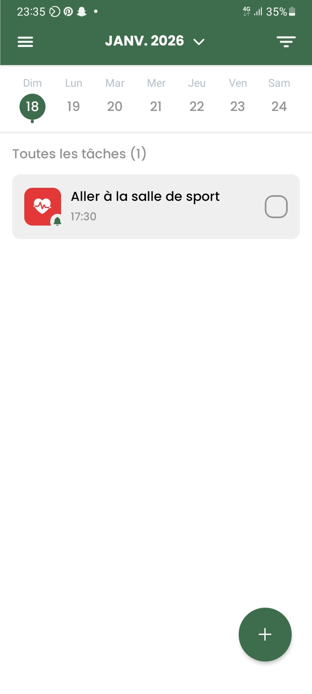
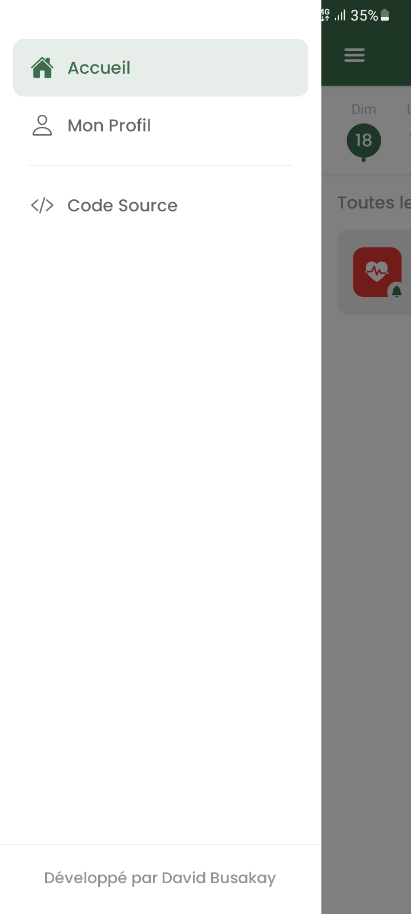
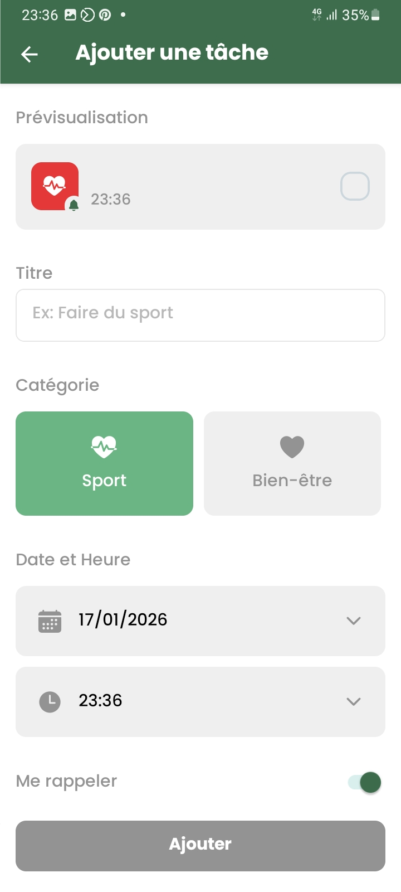

# TopTâches

**TopTâches** est une application mobile de gestion de tâches (To-Do List) minimaliste et intuitive, développée avec **React Native** et **Expo**. Elle aide les utilisateurs à organiser leur quotidien grâce à un système de rappels intelligents.

---

## Aperçu

| Écran Principal | Menu Latéral | Ajout de Tâche |
| :---: | :---: | :---: |
|  |  |  |

---

## Fonctionnalités

- **Gestion de tâches :** Créer, cocher et supprimer des tâches en un clic.
- **Rappels Intelligents :** Planification de notifications locales avec sélecteur de date et d'heure.
- **Logique de Notification Dynamique :**
    - Annulation automatique du rappel si la tâche est complétée.
    - Reprogrammation automatique si une tâche est décochée (si l'heure n'est pas passée).
- **Interface Épurée :** Design soigné avec une palette de couleurs apaisante.
- **Navigation Personnalisée :** Menu latéral (Drawer).

---

## Stack Technique

- **Framework :** [React Native](https://reactnative.dev/) (Expo SDK 50+)
- **Navigation :** [React Navigation](https://reactnavigation.org/docs/getting-started)
- **Dates & Heures :** [day.js](https://day.js.org/) & `@react-native-community/datetimepicker`
- **Notifications :** `expo-notifications`
- **Stockage :** `@react-native-async-storage/async-storage`

---

## Installation et Lancement

1. **Cloner le projet**
    ```bash
    git clone https://github.com/DavidBusakay/TopTaches
    ```
    
    ```bash
    cd toptaches
    ```

2. **Installer les dépendances**
    ```bash
    npm install
    ```

3. **Lancer l'application**
    ```bash
    npx expo start
    ```

---

### Développeur David Busakay

- Portfolio : https://davidbusakay.vercel.app/